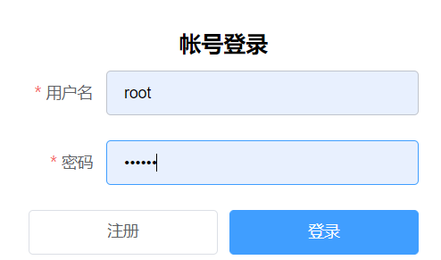

# 基于springboot2+vue2.X的音乐网站

#### 介绍
基于springboot2+vue2.X的音乐网站
开源地址：https://github.com/Yin-Hongwei/music-website

在这个项目的基础上增加了MV功能和修改了部分bug，仅供学习交流，侵权联系我删除

#### 技术实现
springboot(springmvc + spring + mybatis) + vue + mysql

#### 安装教程

1.  xxxx
2.  xxxx
3.  xxxx

#### 使用说明

1.  
系统前台访问地址：http://localhost:8081

系统后台访问地址：http://localhost:8080

账号和对应密码：
管理员： admin    1
.jpg)
用户：  root     123456

2.  xxxx
3.  xxxx

#### 参与贡献

